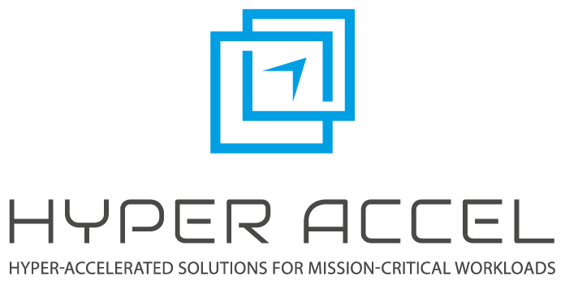

<!---
Copyright 2023 The HyperAccel. All rights reserved.
-->

     
    
     

**HyperDex SDK** is designed to transform the way deep learning models are deployed on **HyperAccel’s LPU** architecture, delivering a balance of high performance and energy efficiency. Whether you’re working with models built in HuggingFace LLM models, HyperDex ensures a smooth transition to the LPU, allowing you to focus on innovation rather than infrastructure.

Our SDK offers everything you need in one stack—compiler, runtime, and drivers—providing a straightforward solution to integrate your pre-trained models into production environments. The unique efficiency of the LPU minimizes the need for extensive manual optimization, allowing you to accelerate deployment without compromising on performance.

With **HyperDex**, deployment becomes simpler, empowering you to fine-tune your models and unlock the full potential of LPU technology. From enhanced power savings to robust processing capabilities, HyperDex brings flexibility and speed to your machine learning workflows.

For detailed guidance on using the **HyperDex SDK**, please [contact to us](mailto:contact@hyperaccel.ai). If you need any assistance, our team is here to support you every step of the way.