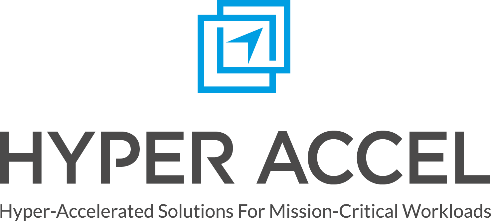

<!---
Copyright 2023 The HyperAccel. All rights reserved.
-->

     
    
     

**LLM Processing Unit(LPU)** is latency-optimized and highly scalable hardware architecture that executes large language model (LLM) inference. LPU architecture delivers high performance and energy efficiency compared to other accelerators such as NVIDIA GPU.

**HyperDex** is the end-to-end (E2E) software stack designed specifically for LPU. It enables you to fine-tune your models and fully harness the power of LPU technology. With features that deliver enhanced power efficiency and robust processing capabilities, HyperDex provides the flexibility and speed needed to accelerate your machine learning workflows.

**HyperDex API** is fully compatible with the HuggingFace framework, vLLM, and other custom frameworks. Whether you’re working with HuggingFace LLM models or other models, HyperDex ensures a seamless transition to the LPU. This allows you to focus on innovation, without worrying about infrastructure challenges. 

**HyperDex SDK** delivers a complete solution in a single stack, encompassing the compiler, runtime, and drivers, providing a straightforward solution to integrate your pre-trained models into production environments. The unique efficiency of the LPU minimizes the need for extensive manual optimization, enabling faster deployment without compromising on performance.

In this docs, we will break down HyperDex into Quick Start, Software Stack, and About LPUs. Please [contact to us](mailto:contact@hyperaccel.ai) if you need more help or any assistance. Our team is here to support you every step of the way.

